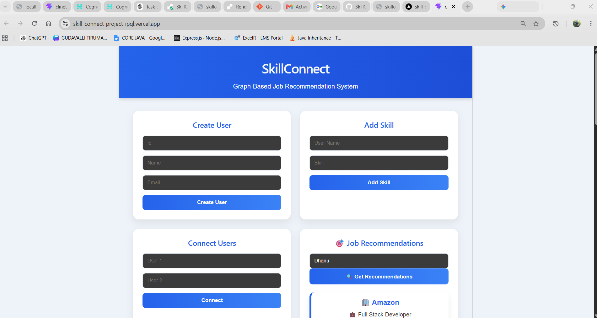
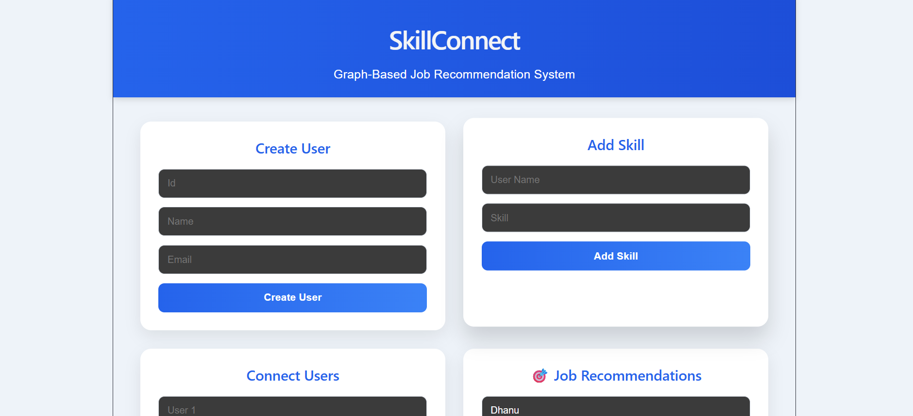
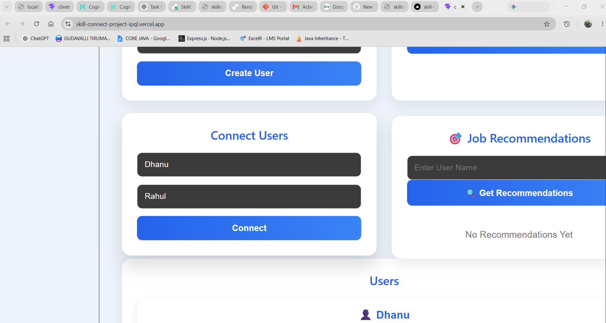
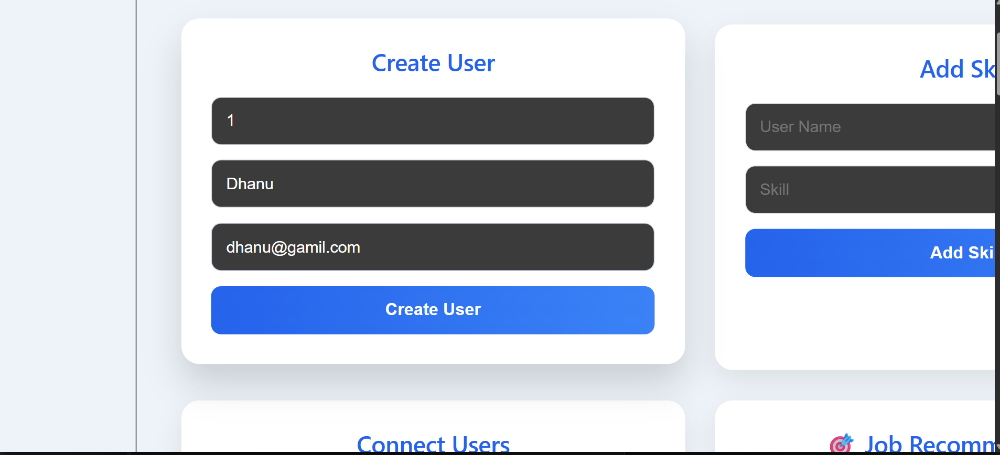
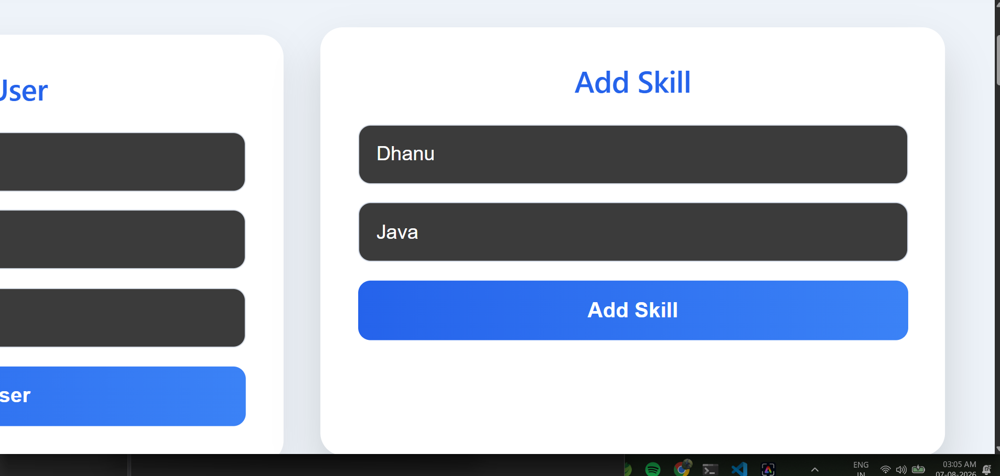
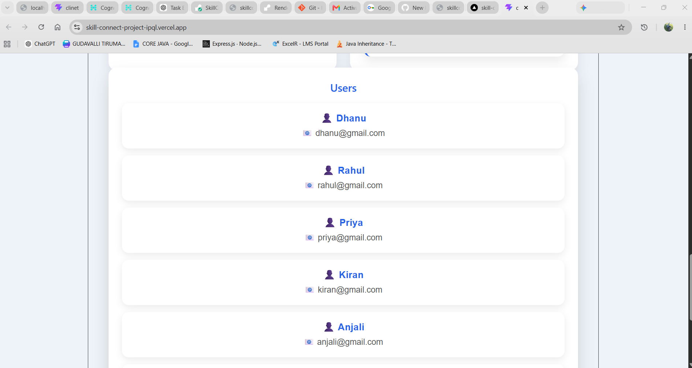
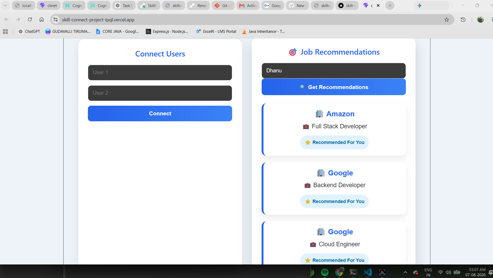
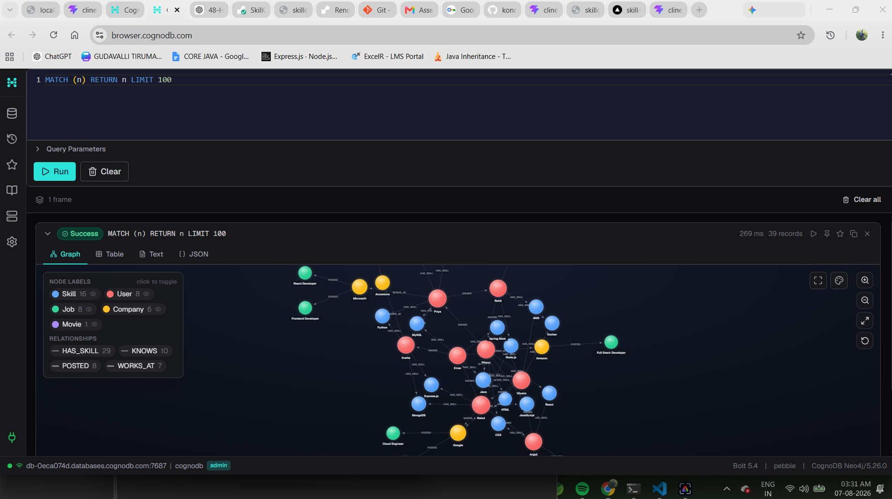

# 🚀 SkillConnect

SkillConnect is a Full Stack Graph-Based Networking Platform built using React, Node.js, Express, and Neo4j (CognoDB).

The application allows users to:

- Create profiles
- Add technical skills
- Connect with other users
- Receive job recommendations based on graph relationships

---

## 🔗 Project Links

🌐 **Live Demo:**  
https://skill-connect-project-ipql.vercel.app/

📂 **GitHub Repository:**  
https://github.com/kondagudavalli/SkillConnect_Project

## 📸 Project Preview



---

# ✨ Features

✅ Create User

✅ Add Skills

✅ Connect Users

✅ Graph Database (Neo4j)

✅ Job Recommendation Engine

✅ Responsive UI

✅ REST APIs

✅ Full Stack Application

---

# 🛠 Tech Stack

## Frontend

- React.js
- Axios
- CSS3
- Vite

## Backend

- Node.js
- Express.js

## Database

- Neo4j (CognoDB)

## Deployment

- Vercel
- Render

---

# 📂 Project Structure

```
SkillConnect
│
├── client
│   ├── src
│   ├── public
│   └── package.json
│
├── server
│   ├── controllers
│   ├── routes
│   ├── config
│   ├── seed
│   ├── queries
│   └── package.json
│
└── README.md
```

---

# ⚙ Installation

## Clone Repository

```bash
git clone https://github.com/kondagudavalli/SkillConnect_Project.git
```

```
cd SkillConnect_Project
```

---

## Backend

```
cd server
npm install
npm run dev
```

---

## Frontend

```
cd client
npm install
npm run dev
```

---

# 🌐 Environment Variables

Create a `.env` file inside the server folder.

```
PORT=5000

NEO4J_URI=your_database_uri

NEO4J_USERNAME=your_username

NEO4J_PASSWORD=your_password
```

---

# 📡 API Endpoints

## Users

```
GET /api/users
```

```
POST /api/users
```

---

## Skills

```
POST /api/users/skill
```

---

## Connections

```
POST /api/users/connect
```

---

## Recommendations

```
GET /api/recommendations/:name
```

---

# 📷 Screenshots

### Home Page



### Connect users


### Create User


### Add skill


### Users


### Recommendations


---

# 👨‍💻 Author

**Gudavalli Tirumala Konda**

B.Tech CSE

Java Full Stack Developer

GitHub:
https://github.com/kondagudavalli

LinkedIn:
https://www.linkedin.com/in/tirumala-konda-gudavalli-161016274/

---

# cognoDB Info:

## DataGraph Digaram



# ⭐ Future Improvements

- Authentication (JWT)

- Login & Signup

- User Profile Images

- Skill Endorsements

- Company Dashboard

- Friend Suggestions

- AI Job Recommendation

- Notifications

---

# 📜 License

This project is created for educational and learning purposes.